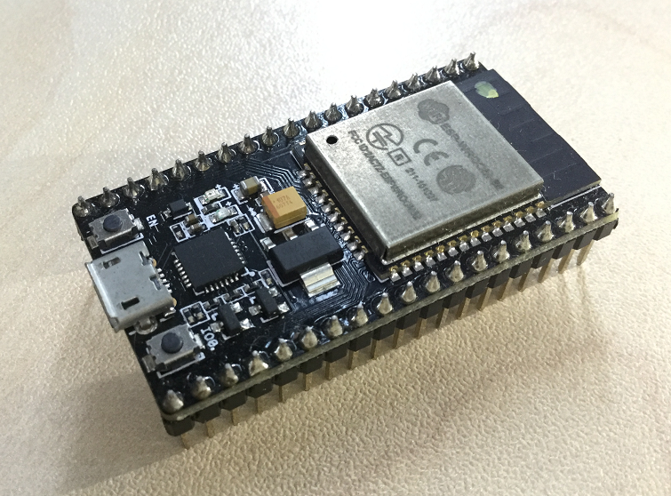
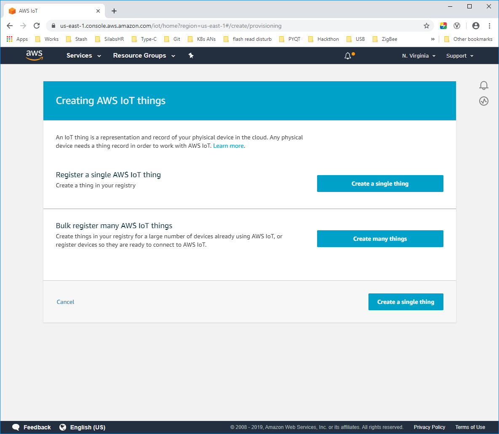
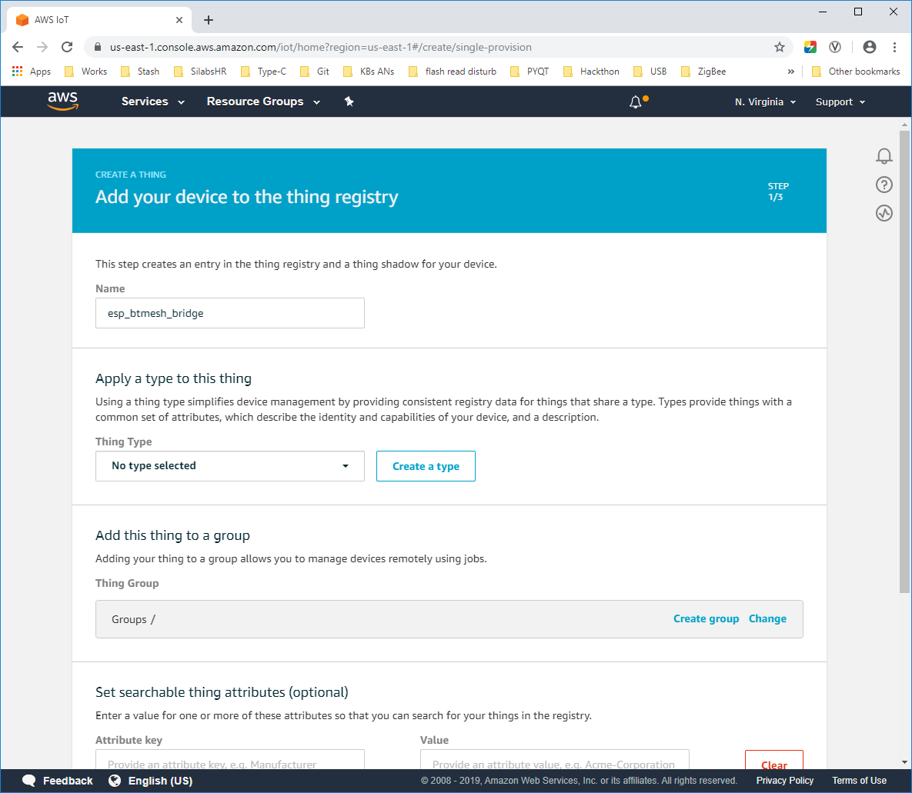

# Table of Content

[Project Background:](#project-background)
  - [Project Devices:](#project-devices)
  - [Project Preparation:](#project-preparation)
[Project Overview](#project-overview)
  - [Topology](#topology)
      - [Alexa skill](#alexa-skill)
      - [AWS IoT Core](#aws-iot-core)
      - [AWS FreeRTOS:](#aws-freertos)
      - [Bluetooth mesh network:](#bluetooth-mesh-network)
  - [Technical details:](#technical-details)
      - [Alexa Smart Home Skill](#alexa-smart-home-skill)
      - [AWS IoT Core](#aws-iot-core-1)
      - [ESP32 and AWS freeRTOS](#esp32-and-aws-freertos)
      - [Bluetooth Mesh Network](#bluetooth-mesh-network)
      - [Communications:](#communications)
[Replication the project](#replication-the-project)
  - [Preparation](#preparation)
      - [Components:](#components)
      - [Software Used:](#software-used)
  - [Procedures:](#procedures)
  - [1.	Configure the AWS IoT core settings:](#1-configure-the-aws-iot-core-settings)
  - [Download and set up freeRTOS SDK:](#download-and-set-up-freertos-sdk)
      - [Download the project](#download-the-project)
      - [Build the esp32 program](#build-the-esp32-program)
      - [Build BG13 embedded provisioner program](#build-bg13-embedded-provisioner-program)
      - [Build MG21 Bluetooth mesh light/switch/sensor/sensor monitor program](#build-mg21-bluetooth-mesh-lightswitchsensorsensor-monitor-program)
      - [Lambda function:](#lambda-function)
      - [Alexa skill:](#alexa-skill)
[Conclusion:](#conclusion)


# Project Background:
As the development of the smart home market, the need for controlling smart devices using human voice grows rapidly. The leading companies all over the world introduced many different solutions in the area of smart home to satisfy their customers’ requirements. Among those solutions, the most popular pattern is to control smart devices via a central smart speaker, which listens to the user’s voice command and responds with actions, such as turning on/off smart lights, adjusting the room temperature through sending remote signals to the AC, and even cooking a nice meal by operating an intelligent robot. 
However, one thing often happens that breaks this good image is that the customers often find the smart speaker does not support their smart devices. That happens mainly due to one big reason—the communicating protocols used by the smart speaker and the endpoint device are not same.  
Currently, there are three protocols mostly used in the smart home industry: Bluetooth mesh, Zigbee, and Z-Wave. In Chinese and the U.S. market, Bluetooth mesh and Zigbee are the mainly used protocols due to their many advantages, such as low power consumption, extendible network size, and strong security.  
In the US, the Zigbee is selected by Amazon as the communicating protocol between its smart speaker brand —Amazon Echo -- and the various smart devices in its ecosystem.  
While in China, the Bluetooth mesh is the primary protocol that most smart devices company are using. Therefore, the Amazon Echo is not able to control those devices due to the incompatible communicating protocol.  
In this project, a solution is proposed to solve this problem.  
A Bluetooth mesh network is going to be controlled by an Amazon Echo Plus 2 via cloud-to-cloud approach. The user can turn on and turn off a Bluetooth mesh light by giving a voice command to the Echo Plus.  

## Project Devices:
* Amazon Echo Plus 2  
* Silicon Labs Wireless Gecko EFR32xG21 *2  
* Silicon Labs Blue Gecko EFR32BG13  
* Espressif Esp32 WROOM 32D	 

## Project Preparation:
* Install the Alexa App in you iOS device. Note that the Alexa App is only available for some special regions, for e,g. US, you need to Login the AppStore with a special Apple ID. And below is an Apple ID hosted by APAC regional apps team, you can feel free to use it.
   * UserName: silabs_iot_ra_apac@outlook.com
   * Password: Register_2019
* Register the Amazon with your own account or use the available account below. For this demonstration, we have registered the account as below.
   * UserName: silabs_iot_ra_apac@outlook.com
   * Password: register_2019
* Also you can / should Sign-in the Alexa App with the same account as above.
* Register AWS in https://portal.aws.amazon.com/billing/signup#/start. The AWS is used for holding the lambda function, and credit card information is needed for registering a new account of the AWS.
   * The account information for AWS is not public.
   * UserName: yuancheng@xxxxxx
   * Password: xxxxxx
 
# Project Overview
## Topology
 
<div align="center">
  
</div>

### Amazon Echo Plus 2
Amazon Echo is a brand of smart speakers developed by Amazon. Echo devices connect to the voice-controlled intelligent personal assistant service Alexa, and the Echo Plus has a built-in Zigbee hub to easily setup and control your compatible smart home devices.

### AWS Lambda
AWS Lambda lets you run code without provisioning or managing servers. You pay only for the compute time you consume - there is no charge when your code is not running.
With Lambda, you can run code for virtually any type of application or backend service - all with zero administration. Just upload your code and Lambda takes care of everything required to run and scale your code with high availability. You can set up your code to automatically trigger from other AWS services or call it directly from any web or mobile app.
<div align="center">
  
</div>

### Alexa skill
The Alexa skill is the bridge that connects the users to AWS IoT could.  
After Amazon Echo receiving the user’s voice commands, it will sent the voice record to AWS Alexa server(AI assistant server), where interprets the voice command to control directives. Then, the Alexa server sends the directives to lambda server, **a place running the skill code**. In the Lambda server, the specific action is executed according to the content of the directives. For example, if the user says “Alexa, turn on my light”, the Alexa will analysis this voice command and sending a JSON formatted file which listed a bunch of information about the light and actions to be executed to lambda, and then lambda will modify the light status from “OFF” to “ON” in the database.

### AWS IoT Core 
AWS IoT Core is a powerful platform to manage IoT devices remotely. It has a service called **Thing Shadow**, which is a JSON document recording the information of the devices it manages. In this project, the AWS IoT plays the role of the system database. It records every device’s status in the Thing Shadow document and could be visited by ESP32 via the integrated AWS freeRTOS SDK.
**Thing Shadows**: a JSON document that is used to store and retrieve current state information.

### AWS FreeRTOS  
AWS freeRTOS is running on ESP32 board. It connects the local network to the AWS cloud.  
ESP32: ESP32 is the gateway in this project. When it runs, it continuously gets the Thing Shadow document from the AWS IoT Core, and then it translates the JSON directives to simple character strings. Through UART communication, it passes the commands to the provisioner in the Bluetooth Mesh network, and the provisioner will give the specific directives to appointed devices.

### Bluetooth mesh network:
In this project, a simple Bluetooth network is created that includes two mesh node and of course a provisioner. The provisioner in the network to provision new devices and receive commands from ESP32 via UART, and also parse the commands from ESP32 and transfer to the mesh command and transmite it to the mesh network for controlling other nodes. 
There are total two Bluetooth mesh nodes in the network, a light node and a switch node. Once the user presses the button on the switch node, the light node would receive a BLE mesh message and turn on/off the embedded LED on it.

<div align="center">
  
</div>

<div align="center">
  
</div>

Also, the switch node is capable to change the online shadow document. When the user give it a long press on left button, the switch node will send a message to provisioner to update the online shadow document.

<div align="center">
  
</div>

## Technical details:
In this section, the technical details below will be introduced.
* Alexa Smart Home Skill
* ESP32 freeRTOS application
* Bluetooth Mesh provisioner

sample codes, including lambda function, Alexa smart home skill, ESP32 freeRTOS application, and the codes of the Bluetooth Mesh provisioner (based on EFR32BG13) will also be explained.  

However, because of the limited length of this article, if the reader wants to replicate the project, please reference the section of [Replication the project](#replication-the-project) for the step by step guidance, and read the GitHub page: https://github.com/sheldon123z and find the mentioned packages accordingly.

### Alexa Smart Home Skill
Alexa smart home skill interface is designed for controlling smart home devices using Amazon Echo series smart speaker by Amazon. In this project, an Echo plus 2 was utilized to receive the voice command and transmit the voice command to the Alexa server.
The skill is held by a lambda function, which means the code is running on the Amazon lambda server. When a user gives the smart speaker a voice command, the command will be firstly analyzed on Alexa server. Then, a JSON format directive will be sent to lambda. There are many different directives. The most important one is the discovery directive, which indicates the speaker to find any available devices and report back to the Alexa server.
In this project, the response is also generated by the same lambda function. After receiving the discovery directive, the lambda function will directly send a response message back. Therefore, the device information needs to be programmed in the codes.

```
if namespace == 'Alexa.Discovery':  
    if name == 'Discover':  
        adr = AlexaResponse(namespace='Alexa.Discovery', name='Discover.Response')  
        #create capability part for the response  
        adr = create_discover_response(adr)               
        return send_response(adr.get())   
```

The “```AlexaResponse()```” function is used to generate the response--- a JSON document. It uses **kwags parameter to receive whatever the user appointed attributes. Among those attributes, the “namespace” and “name” is necessary to add. Alexa server will use this information to identify what the response is and give a feedback to the user.

```
#create the discover response   
#first create the capabilities that the endpoints need   
#then add the endpoints to the response entity, and add the capability information to the endpoints  
def create_discover_response(response):  
    #general response  
    capability_alexa = response.create_payload_endpoint_capability()  
    #specific capabilities  
    #power controller--turn on turn off operations  
    capability_alexa_PowerController = response.create_payload_endpoint_capability(  
        interface='Alexa.PowerController',  
        supported=[{'name': 'powerState'}])  
    #create colorcontroller capability  
    capability_alexa_ColorController = response.create_payload_endpoint_capability(  
        interface='Alexa.ColorController',  
        supported=[{'name': 'color'}])  
    #create brightnessController capability  
    capability_alexa_BrightnessController = response.create_payload_endpoint_capability(  
        interface='Alexa.BrightnessController',  
        supported=[{'name': 'brightness'}])  
    #create colortemperature capability  
    capability_alexa_ColorTemperatureController = response.create_payload_endpoint_capability(  
        interface='Alexa.ColorTemperatureController',  
        supported=[{'name': 'colorTemperatureInKelvin'}])  
    #create lock controller capability  
    capability_alexa_lockcontroller = response.create_payload_endpoint_capability(  
        interface='Alexa.LockController',  
        supported=[{'name':'lockState'}]  
    )  
    capability_alexa_endpointHealth = response.create_payload_endpoint_capability(  
        interface='Alexa.EndpointHealth',  
        supported = [{'name':'connectivity'}]  
    )       
```

The capability and endpoint id compose the virtual representation of a smart device. One device can simultaneously own several different capabilities. For example, a light can support PowerController, ColorController, and ColorTemperatureController capabilities to control the on/off, color, and temperature attributes.
After constructing the capabilities of the device, we also need to add other device information and the endpoint id to the response.

```
response.add_payload_endpoint(  
    friendly_name='Sample Switch',  
    endpoint_id='sample-switch-01',  
    manufactureName = 'silicon labs',  
    display_categories = ["SWITCH"],  
    discription = 'silicon labs product',   
    capabilities=[capability_alexa, capability_alexa_PowerController])  
```

The "```display_categories```" item will tell Alexa what type of the device is. Alexa will show the corresponding icon on the Alexa phone application.
The discovery response is needed only once. It is similar to the process of registering the device to Alexa server. After this registration, Alexa is connected to the smart devices; the user can see the device on the Alexa application.  
Every time Alexa gives a directive, the lambda function will respond a corresponding message to Alexa and execute the directive via changing the status of the device on the IoT core. In the lambda function, every controller interface needs a specific method to handle.

```
def respond_brightnessControl_dir(request):  
    # Note: This sample always returns a success response for either a request to TurnOff or TurnOn  
    endpoint_id = request['directive']['endpoint']['endpointId']  
    correlation_token = request['directive']['header']['correlationToken']  
    token = request['directive']['endpoint']['scope']['token']  
    name = request['directive']['header']['name']  
    #get the brightness from the directive  
    brightness_value = request['directive']['payload']['brightness']  
    thingshadow_updated = update_thing_shadow(thing_name_id=endpoint_id,brightness=brightness_value)  
      
    #check the operation if successful  
    if not (thingshadow_updated):  
        return AlexaResponse(  
        name='ErrorResponse',  
        payload={'type': 'ENDPOINT_UNREACHABLE', 'message': 'Unable to reach endpoint database.'}).get()  
    #abtr: alexa brightness response  
    abtr = AlexaResponse(  
        coorelation_token = correlation_token,  
        endpoint_id=endpoint_id,  
        token = token)      
    abtr.add_context_property(namespace = 'Alexa.BrightnessController',name = "brightness",value = brightness_value)  
```

For instance, a brightness controlling directive for light could be executed and responded by the function above. The lambda function will first analyze the directive, extract the information such as the endpoint_id, the correlation_token(which is used in response to Alexa), and the specific actions to be done. Then the lambda function will access to the IoT core, update the corresponding attribute information on the appointed virtual device using “update_thing_shadow” function. If the updating action is done successfully, lambda will give an acknowledging response to Alexa; else it will give an ErrorResponse. 

As mentioned above, the Lambda function is the place to hold Alexa skill. The codes in the lambda function are basically the essence of the Alexa skill. However, to associate a Lambda function and an Alexa smart home skill, several steps need to be done.
First, create an Alexa smart home skill on [Alexa developer console](https://developer.amazon.com/alexa/console/ask/create-new-skill). 
https://developer.amazon.com/alexa/console/ask/create-new-skill
* Fill the Skill name, for instance, silabs_apac_alexa_btmesh_demo
* Select the “Smart Home” and click “Create skill” button in the top right of this page.

<div align="center">
  
</div>

At the Alexa console, the “Default endpoint” should be set as the endpoint of the lambda function. 
Also, the skill ID should also be set on the lambda function. Therefore, the skill is associated with the lambda function.

<div align="center">
  
</div>   
   

<div align="center">
  
  <center> <b>Figure: Lambda function adding Alexa smart home trigger</b> </center>
</div>  

After mutual association, the second step would be account linking. On the Alexa console, click on the account linking option, input the authorization URI and the access token URI as shown below.

<div align="center">
  
  <center> <b>Figure: Account linking</b> </center>
</div>  

The account linking in this project is using Login with Amazon(LWA), which gives the log in the authorization right to Amazon. If a third-platform is used to communicate with Alexa, the account linking must be set using Aouth2.0. Because this project doesn’t have a device cloud, so here we just use LWA.
Amazon console also supports the skill-testing. Click on the “Test” option; another interface comes out.

<div align="center">
  
  <center> <b>Figure: Skill-testing</b> </center>
</div>  

The developer can choose either typing or using JSON formatted directive to test the Alexa skill. It simulates a real echo plus speaker to send the directives to the server where holding the Alexa skill.
For example, if the user type or say “turn on my light”, the Alexa server will send a turn-on directive to the lambda(the skill holder server).

<div align="center">
  
  <center> <b>Figure: Turn on a light</b> </center>
</div>  

<div align="center">
  
  <center> <b>Figure: TurnOn JSON directive</b> </center>
</div>  

Then the lambda function will handle the directive and give a response.

<div align="center">
  
  <center> <b>Figure: TurnOn response</b> </center>
</div>  

The keywords “event” and “directive” on the top of the JSON file marks what the message is and where does the message from.
Lambda function:
As introduced before, the lambda function is the place holding Alexa skills. Every “directive” is processed and handled in the lambda function. It is quite complex to set up a lambda function, the detailed steps to set up a lambda function can be found [here](https://docs.aws.amazon.com/lambda/latest/dg/getting-started.html), and the Chinese version documentation is available [here](https://docs.aws.amazon.com/zh_cn/lambda/latest/dg/getting-started.html).
The lambda function has multiple servers in different areas of the world. However, some of them don’t support Alexa smart home skills. This project chooses **US East(N.Virgina)** server to hold the skill.

<div align="center">
  
  <center> <b>Figure: Lambda function console</b> </center>
</div>  

On the lambda function console, paste the Alexa smart home skill code to the editor. On the upper right corner, the testing case can be built. You can define different directives to test the skill if it works well or not. 

<div align="center">
  
  <center> <b>Figure: A TurnOn directive test case</b> </center>
</div>  

The directive will be the input for the specified lambda handler. A quick click on the test button, the response will show up on the bottom of the console.

<div align="center">
  
  <center> <b>Figure: Response of the lambda function</b> </center>
</div>  

It is worth to mention the rating of the lambda function. The AWS lambda has free tiers for each user, up to 1,000,000 free requests per month. In this project, only requests to lambda function and IoT Core are used, so the free tier is totally enough.

<div align="center">
  
  <center> <b>Figure: AWS lambda free tiers</b> </center>
</div>  


### AWS IoT Core
AWS IoT Core is another platform of AWS IoT service.  It stores the status information of the remote IoT devices in a special service called Thing Shadow. Briefly speaking, the thing shadow is a JSON document for recording the real-time changes of the device status.

<div align="center">
  
  <center> <b>Figure: IoT Core Thing Shadow</b> </center>
</div>  

The Thing shadow can be modified by both lambda function and local mesh network. In this project, it has been set with four nested layers: state, desired/reported, device name, and attributes. 
The “state” and “desired/reported” is required for each document uploaded, and once the user uploads a new document, only the items in the new document will be updated. The rest of the items will remain the same value. Also, if the desired/reported sections are not the same value, the document will automatically generate a new section called delta, which records the differences between the desired section and reported section.

<div align="center">
  
  <center> <b>Figure: JSON document for thing shadow</b> </center>
</div>  

### ESP32 and AWS freeRTOS
ESP32 is the network gateway and responsible for downloading the shadow document, uploading new shadow document, and forwarding directives to the local mesh network. It communicates with the provisioner of the mesh network via UART communication. The JSON document will be first converted to a local string directive and then sent to the provisioner board.  
The ESP32 board acquires shadow document from IoT core via MQTT protocol. On the IoT Core, each device has a virtual counterpart. To get the shadow document of a device, the user needs to publish a blank message to the MQTT topic “$aws/things/device name/shadow/get”.  The MQTT server will respond with the specified shadow document. Similar operations such as update the shadow and delete the shadow can also be done in this way.
The code in the ESP32 follows a linear structure. There are two ways to get the thing shadow from IoT console. For the first one, it begins with establishing internet connection and MQTT connection, then using the function “AwsIotShadow_Get” to acquire the shadow document continuously in an infinite loop. Once it obtained the shadow, it transfers the text into a more straightforward string directive. The provisioner will also give an acknowledging message with the same format after the directive has been executed. The esp32 will according to the message to update the thing shadow document in the next loop.
For the second one, a callback function called xxx (the information is missing, I need to repair it later.)

<div align="center">
  
  <center> <b>Figure: ESP32</b> </center>
</div>  

### Bluetooth Mesh Network
The Bluetooth mesh network is composed of three parts: A switch node, a light node, and a provisioner node.
The provisioner in the network is responsible for establishing the mesh network, authorizing new devices, and receiving messages from outside. The provisioner program obeys the “event-driven” pattern in a big “switch” structure. Every coming event will have an event id and the even data. The application invokes different handler functions to extract information and give responses back according to the event id. Through using the UART interrupt, the provisioner can detect messages come from the esp32 board. Also, when the provisioner receives the event id, which indicates the status changes from mesh network endpoints, it will invoke the UART TX handler to send messages to the ESP32. Moreover, the switch node can control the light node. The provisioner also subscribed the switch node message, which means that it will receive a notification when the switch turns on or turns off the light. The status information of the node will be displayed directly on the Alexa phone application, and the user can also control the devices via the app.

### Communications:
This project uses different protocols to do communications among different parts. The MQTT protocol is utilized for communicating with the **AWS IoT Core** console, where the thing shadow document is stored; and the Bluetooth mesh is used to organize local devices. Between the ESP32 and the provisioner node in the mesh network, a self-defined simple UART protocol is also used to transmit the devices information and attribute information. Each packet of the UART protocol contains 41 char bytes, and the format is shown below.

<div align="center">
  
  <center> <b>Figure: UART packet format</b> </center>
</div>  

The first byte is used to identify what type of operation is. Currently, the operation supports only change device state; the following bytes are used to determine the device type, the attribute name, and the attribute value. What is worth to pay attention is that the attribute value possibly number or string, therefore, in the code it has to be adjusted using the function “atoi()”

<div align="center">
  
  <center> <b>Figure: Operation type definition</b> </center>
</div>  

<div align="center">
  
  <center> <b>Figure: Device type definition</b> </center>
</div>  

<div align="center">
  
  <center> <b>Figure: Attribute type definition</b> </center>
</div>  

<div align="center">
  
  <center> <b>Figure: Light default data definition</b> </center>
</div>  

# Replication the project
In this section, a step-by-step instruction will be provided to the reader to replicate the project.
## Preparation
### Components: 
* 1. WSTK board x3 (if possible, 5 is the best)
* 2. EFR32BG13 2.4GHz 10dBm x1
* 3. EFR32 xG21 2.4GHz 10dBm x2
* 4. Espressief ESP32-WROOM-32D x1
* 5. Wire jumpers x3 
* 6. CP2103-EB(for debugging)
### Software Used:
* 1. Simplicity Studio IDE
* 2. Bluetooth mesh SDK v1.5.0 or above
* 3. Amazon AWS freeRTOS SDK (click to open github page)
* 4. Any COM port monitor tool (Tera Term)

## Procedures:
## 1.	Configure the AWS IoT core settings: 
a.	Please carefully read the [documentation page](https://docs.aws.amazon.com/zh_cn/freertos/latest/userguide/freertos-getting-started.html) on how to setup the AWS freeRTOS SDK on your computer.
b.	[Setting up your AWS Account and Permissions](https://docs.aws.amazon.com/zh_cn/freertos/latest/userguide/freertos-account-and-permissions.html), this step gives you right to access AWS IoT console
c.	Log into AWS IoT console, open the services and choose **N.Virginia** as the server 
https://us-east-1.console.aws.amazon.com/iot/home?region=us-east-1#/dashboard

<div align="center">
  
  <center> <b>Figure: AWS IoT console</b> </center>
</div>  

d.	Create a thing called “esp32” on your AWS console: 
click Manage -> Thing -> Register a thing -> CreateCreate a Single thingCreate certificate -> Download the certificate and Activate. 
Carefully preserve the thing certificates downloaded. 

<div align="center">
  
  <center> <b>Figure: Create a thing</b> </center>
</div>  

<div align="center">
  
  <center> <b>Figure: Name the thing as esp32</b> </center>
</div>  

<div align="center">
  
</div>  

e.	Go back to the console, open your thing “esp32”. Click Security -> Your certificate -> Policies -> Actions -> Attach Policy, if you have a policy, change it to:
f.	And also don’t forget to modify the “Resource” as the lambda of yours.

```
{
  "Version": "2012-10-17",
  "Statement": [
    {
      "Effect": "Allow",
      "Action": "iot:Connect",
      "Resource": "arn:aws:iot:us-east-1:330321474979:*"
    },
    {
      "Effect": "Allow",
      "Action": "iot:Publish",
      "Resource": "arn:aws:iot:us-east-1:330321474979:*"
    },
    {
      "Effect": "Allow",
      "Action": "iot:Subscribe",
      "Resource": "arn:aws:iot:us-east-1:330321474979:*"
    },
    {
      "Effect": "Allow",
      "Action": "iot:Receive",
      "Resource": "arn:aws:iot:us-east-1:330321474979:*"
    }
  ]
}
```
If you don’t have a policy, go back to console -> secure -> policy -> create You can create a policy to then attach it.
<div align="center">
  
  <center> <b>Figure: Certificate</b> </center>
</div>  

<div align="center">
  
</div>  

<div align="center">
  
  <center><b>Figure: Create a policy in this interface</b></center>
</div>  

g.	Click on the Manage -> Thing -> esp32 -> Shadow -> Edit, paste the initial shadow document. The initial shadow document must have the same desired and reported section, if you want to change the shadow document, remember to change the shadow document template on the esp32 board and Alexa skill, or the program won’t run correctly.


<div align="center">
  
  <center><b>Figure: Shadow document</b></center>
</div>  

*Initial Shadow document see appendix
h.	You can try to update the shadow document in this interface, or using Test function on AWS IoT console. Click on the “Interact” option, choose the corresponding topic which represents the operations that you wish to do, subscribe to the topic.

<div align="center">
  
  <center><b>Figure: Topic to subscribe</b></center>
</div>  

<div align="center">
  
  <center><b>Figure: Subscribe the topic and publish content you want</b></center>
</div>  

##  Download and set up freeRTOS SDK:
### Download the project
a.	Go to GitHub page to download the SDK or clone it by using git clone https://github.com/aws/amazon-freertos.git
b.	Setup the SDK with correct Toolchains and serial connection to your ESP32 board. The very detailed official instruction can be found [HERE](https://docs.aws.amazon.com/freertos/latest/userguide/getting_started_espressif.html).
c.	Open the SDK folder, in the folder …/demos/shadow, replace the C file “aws_iot_demo_shadow.c” with the provided “aws_iot_demo_shadow.c” file. Also, add the file “aws_iot_shadow_blem.h” to the folder.
d.	The WiFi settings can be done in the file …/demos/include/aws_clientcrediential.h
e.	Paste the certificate you acquired when you create the “esp32” thing on AWS IoT console to the file …/demos/includes/aws_clientcrediential_keys.h
f.	Alternatively, you can use the quick setup which instructed [on this page](https://docs.aws.amazon.com/freertos/latest/userguide/getting_started_espressif.html) under Configure the Amazon FreeRTOS Demo Applications section.

###	Build the esp32 program 
a.	In the file:
b.	…/vendors/espressif/boards/esp32/aws_demos/config_files/aws_demo_config.h input. #define CONFIG_SHADOW_DEMO_ENABLED
c.	Follow the building instruction on the manual page to build and flash the application.

### Build BG13 embedded provisioner program
a.	Clone the project from GitHub using “git clone https://github.com/sheldon123z/EFR32-embedded-provisioner.git”
b.	Open the project in simplicity studio, build, flash to BG13 board

### Build MG21 Bluetooth mesh light/switch/sensor/sensor monitor program
a.	The mesh light and switch are using the demo applications in the simplicity studio Bluetooth mesh SDK v1.5.0, you can use other Bluetooth mesh light device in this project.
b.	The mesh switch application is also the demo program in simplicity studio, it has three functions: adjusting the lightness of the light, adjusting the temperature, turning on/off the light. A long press will turn on/off the light, a short press will adjust the lightness, and a normal press will change the temperature. Currently, the provisioner only subscribes the on/off function, when the user give it a short press or long press, the provisioner will report the light’s on/off status to IoT console(while the lightness is not 0, the light’s on/off state will be “ON”).
c.	Sensor/monitor program. The sensor/monitor program is only available after the version 1.5.0 of the Bluetooth mesh SDK. Currently, the IoT console doesn’t monitor the state of the sensor. Once the sensor and the monitor are provisioned, they are functioning as local devices. 

###	Lambda function:
Clone the repo https://github.com/sheldon123z/Alexa-esp32freeRTOS-EFR32BG13-Bluetooth-mesh-project.git
Zip all contents of that directory to python.zip. 

**Create the lambda function:**
a.	Go to https://console.aws.amazon.com/console/home and sign in
b.	Switch the AWS server to “US East (N.Virginia)” on the top right of the page, some of the features are only supported on this server.
c.	Go to Services > Compute > Lambda
<div align="center">
  
</div>  

d.	Click on Create Function
<div align="center">
  
</div>  

e.	Click on “Author from scratch”
f.	Configure your Lambda function
* Name = SampleLambdaFunction (or whatever you want)
* Runtime = Python 3.6 (You can choose any language used to write your function, in this demo, we are using Python 3.6)
* Permission = “Create a new role with basic Lambda permissions”
* Click Create Function

<div align="center">
  
</div>  

g.	Click Triggers -> Add Trigger and select Alexa Smart Home
* Application Id = skill ID of your test skill that you noted above
* Enable trigger = checked
* Click Submit

<div align="center">
  
</div>  

<div align="center">
  
</div>  
 
h.	Also need to add the “DynamoDB” as another trigger. (no need now if there is no database access)
i.	Click the icon of the lambda function for Configuration

<div align="center">
  
</div>  

* Runtime = Python 3.6
* Code entry type = Upload a .ZIP file (the Alexa skill package). After uploading the .ZIP file, please make sure that the self_defined_lambda.py in the root folder.
* Click on Upload and find the python.zip you created earlier
* Handler = self_defined_lambda.lambda_handler
* Click Next
* Click Save
* On the top right corner, note the Lambda ARN
* Lambda ARN: Copy the ARN and it will be used in the next section

<div align="center">
  
</div>  

j.	Then configure the IAM
* Find the IAM services
<div align="center">
  
</div>  

###	Alexa skill:
a.	Log into the [Alexa developer console](https://developer.amazon.com/alexa/console/ask) using your amazon account
b.	Choose Create skill->Smart Home->Enter the skill name->Create
c.	After you created the skill, the first step is to setup the account linking. Smart Home skills require that a user completes account linking during skill enablement. This step asks customers to associate their device cloud account with your smart home skill. You will need an OAuth provider in order to implement this process. If you don't already have an OAuth provider, you can use Login with Amazon (LWA).
d.	Setup the LWA:
* i. Connect to https://developer.amazon.com/login.html and authenticate with your Amazon credentials.
* ii. Click "Login with Amazon"
* iii. Click on “Create a New Security Profile”

<div align="center">
  
</div> 

* iv. Fill in all three required fields to create your security profile and click “Save”. For the “Consent Privacy Notice URL”, please fill it with your own privacy notice URL.

<div align="center">
  
</div> 

* v. Before you complete this step, be sure to click on the link named “Show Client ID and Client Secret” and save these values to a secure location so they're easily available later. You’ll need these values later in a future step.  

e.	Configure the skill:
* i. Go back to https://developer.amazon.com/home.html and sign in as needed
* ii. Go to Alexa > Alexa Skills Kit > the test skill you created earlier
* iii. In the Configuration tab:
* iv. Lambda ARN default = enter your Lambda ARN noted from the previous step
* v. Authorization URI = https://www.amazon.com/ap/oa
* vi. Access Token URI: https://api.amazon.com/auth/o2/token
* vii. Client ID = your client ID from LWA noted in a previous step
* viii.	Client Secret: your client secret from LWA noted in a previous step
* ix. Client Authentication Scheme: HTTP Basic (Recommended)
* x. Scope: profile (click Add Scope first to add)
* xi. Click Save
* xii. Provide Redirect URL's to LWA:
* xiii. The Configuration page for your Skill lists several Redirect URL's. Open the LWA security profile you created earlier and visit the Web Settings dialog. Provide each of the Redirect URL values from your Skill in the “Allowed Return URLs” field.

<div align="center">
  
</div>  

<div align="center">
  
</div>  

f.	Go to https://alexa.amazon.com/spa/index.html#skills

<div align="center">
  
</div>  

8.	Bluetooth mesh network operation guide:
a.	Flash the provisioner program to the BG13 board.
b.	Hold left button and reset button to reset the board
c.	Flash the switch program and light program into board
d.	Open a COM tool and connect it to the BG13 board, when seeing the prompt to provision the switch board and light board, press left button to provision.
e.	After the switch and light board are provisioned, the user can use phone app or the echo plus 2 to control the light.

9.	Application addresses
a.	freeRTOS SDK(including the application file) https://github.com/sheldon123z/amazon-freertos-shadow
b.	embedded provisioner(app.c app.h cJSON.c cJSON.h main.c)
https://github.com/sheldon123z/EFR32-embedded-provisioner.git
c.	Alexa skill (use zip to compress and upload to lambda)
https://github.com/sheldon123z/Alexa-esp32freeRTOS-EFR32BG13-Bluetooth-mesh-project.git
d.	Light and Swtich applications are the demo applications

# Conclusion:
This project uses multiple protocols and Amazon AWS services. It breaks the limitation between the Zigbee embedded smart speaker and Bluetooth mesh embedded smart devices and realizes voice control. Although it is just a brief demonstration, it reveals the potential of multi-platform cooperation and smart automation.
